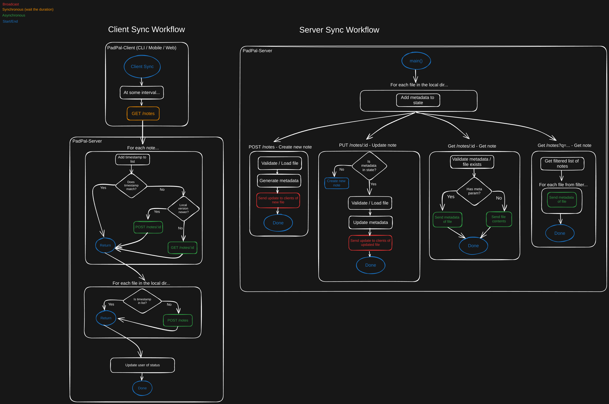

# PadPal-Server
PadPal REST API 

This repo is a part of a larger PadPal project. The following is a list of the relevant repos:
- [PadPal-Server](https://github.com/ssebs/PadPal-Server/)
  - This is the golang REST API server. Files will be saved here.
  - The main README will be here for now.
- [PadPal-CLI](https://github.com/ssebs/PadPal-CLI/)
  - This is the CLI for syncing a workspace / your notes to your computer.
- [PadPal-Mobile](https://github.com/ssebs/PadPal-Mobile)
  - This is the mobile app to interact with a hosted PadPal-Server.

## Progress
> keeping track of where I am / whats next to code / PM stuff

- [ ] Save / Load data files
  - [ ] FileProvider
    - [ ] Create
    - [ ] Read
    - [ ] Update
    - [ ] Delete
  - [x] Test/Sample Provider
    - [x] Create
    - [x] Read
    - [ ] Update
    - [ ] Delete

### Docker
- Install [Docker](https://www.docker.com/get-started/)/[Podman](https://podman.io/docs/installation)
- Running DockerHub image [ssebs/padpal-server](https://hub.docker.com/r/ssebs/padpal-server):
  - `docker run -d -p 5000:5000 --rm ssebs/padpal-server`
- Local / build:
  - Building:
    - `git clone github.com/ssebs/padpal-server`
    - `cd padpal-server`
    - `docker build -t ssebs/padpal-server .`
  - Running:
    - `docker run -d -p 5000:5000 --rm ssebs/padpal-server`
- Unraid:
  - TODO

### Run from src
- Install [go > v1.22](https://go.dev/doc/install)
- `git clone https://github.com/ssebs/padpal-server`
- `cd PadPal-Server`
- `go run cmd/main.go`

## Arch
- Padpal sync server 
- Sync method:
  - Last-write wins
  - Metadata to list files and latest timestamp
  - HTTP to send/recv files
  - Websockets to listen for updates? or service worker? or http polling?
- collaboration and auth:
  - look into SpiceDB!
- Host web editor on the server
- Config file
- Saves files locally

## LICENSE
[Apache License 2.0](./LICENSE)

## Docs
- https://pkg.go.dev/github.com/golang-jwt/jwt#example-package-GetTokenViaHTTP
- UNRAID https://selfhosters.net/docker/templating/templating/#114-shave-off-the-xml
- https://stackoverflow.com/questions/12555043/my-understanding-of-http-polling-long-polling-http-streaming-and-websockets
